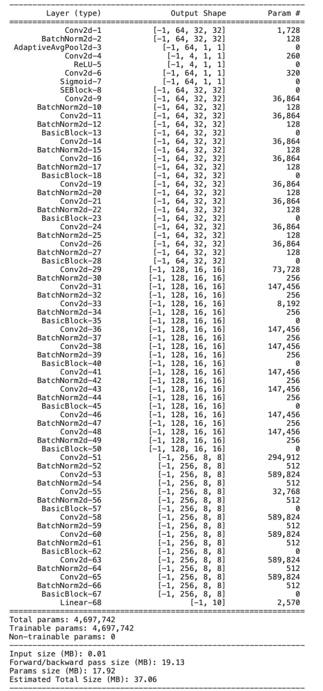
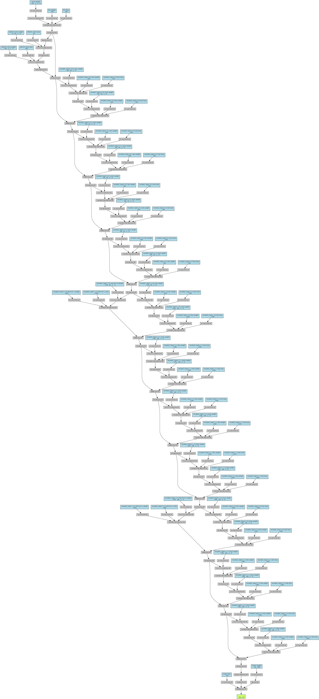

# ECE-GY 6143 Deep Learning Mini Project

This repository contains the source code and documentation for the ECE-GY 6143 Deep Learning Mini Project. 
The project focuses on developing an enhanced ResNet architecture tailored for the CIFAR-10 dataset, integrating 
Basic Blocks and Squeeze-and-Excitation blocks to emphasize the significance of channel interdependencies. 
The model achieves remarkable accuracy while adhering to a parameter-efficient methodology.

## Abstract
The project presents a novel ResNet architecture designed for the CIFAR-10 dataset, leveraging Basic Blocks and 
Squeeze-and-Excitation blocks for enhanced performance. The model achieves impressive accuracy while maintaining parameter 
efficiency, demonstrating its suitability for real-world applications.

## Introduction
The ResNet architecture has revolutionized deep learning by enabling the training of very deep neural networks. 
The project builds upon this foundation to develop a customized ResNet architecture optimized for the CIFAR-10 dataset. 
The architecture incorporates innovative features such as Squeeze-and-Excitation blocks to improve channel-wise feature recalibration.

## Methodology
### PreProcessing
The dataset preprocessing involves data normalization and augmentation to enhance model generalization capabilities. 
Data normalization adjusts pixel values to stabilize training, while data augmentation introduces diversity in training data to improve robustness.

### Model
The proposed ResNet architecture comprises multiple layers of convolutional and residual blocks. Squeeze-and-Excitation 
blocks are seamlessly integrated to enhance feature recalibration capabilities. The model's design adheres to a strict 
parameter limit to ensure scalability and efficiency.

### Hyperparameter Tuning
Key hyperparameters such as convolutional kernel sizes, number of layers, and optimizer settings are carefully tuned for 
optimal performance. The model is trained using Stochastic Gradient Descent with momentum and a dynamic learning rate scheduler.

## Results
The trained model achieves promising results on both the test and hidden datasets. The test dataset yields an accuracy of 95%, 
indicating strong performance on unseen data. Additionally, the model achieves 85.5% accuracy on a hidden dataset, demonstrating robust generalization capabilities.

## System Specification
- **Environment:** NYU HPC VM
- **CPU:** 8 Virtualized Cores of Intel Xeon-Platinum 8286
- **GPU:** Nvidia Quadro RTX 8000
- **System Memory:** 64 GB
- **Python Version:** 3.9.0
- **CUDA version:** v12.1
- **Torch Version:** 2.2.2

## Getting Started
To reproduce the results or explore the project further, follow these steps:
1. Clone this repository to your local machine.
2. Install the required dependencies specified in the `requirements.txt` file.
3. Execute the main Python script to train and evaluate the model.
4. Explore the documentation and source code for detailed insights into the project.

## Contributing
The poject has been done by Raghav Rawat (rr3418), Utkarsh Prakash Srivastava (ups2006) and Srushti Jagtap (sj4182). 

## License
This project is licensed under the Apache 2.0 License. See the `LICENSE` file for more details.
